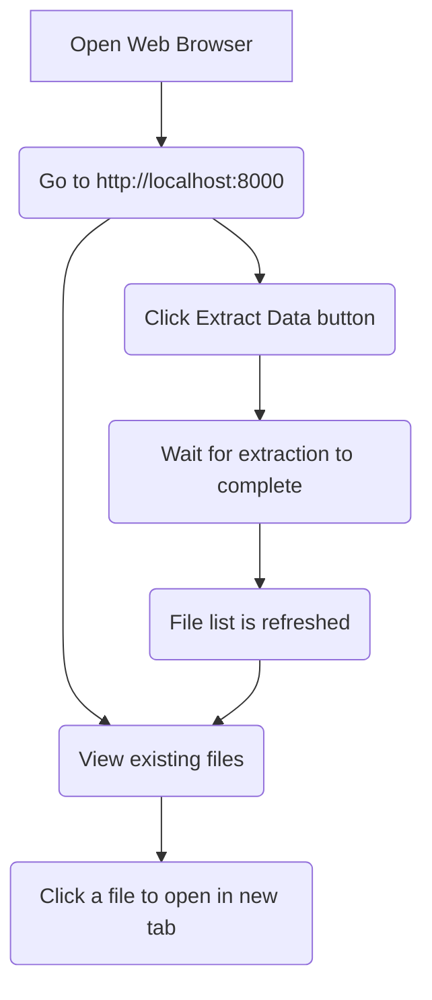

# Zendesk Data Extractor

This project offers a straightforward and efficient solution for extracting customer conversation data from Zendesk. It fetches ticket data, including complete conversation histories, and saves it in both JSON and XML formats. This makes it ideal for various applications, such as data analysis, AI/ML model training, and manual review.

The application includes a web interface to trigger the extraction process and browse the extracted data.

## Key Features

*   **Incremental Backups:** Automatically extracts only the tickets that have been updated since the last run, making the process more efficient.
*   **Automated Data Extraction:** Programmatically extract ticket data from Zendesk, eliminating the need for manual data requests.
*   **Dual-Format Output:** Get your data in both JSON (ideal for data processing) and XML (for easy manual review).
*   **Simple Web Interface:** A user-friendly web UI to start the extraction process and view the results.
*   **Easy to Deploy:** Run the entire application with a single Docker command.
*   **Secure:** Uses environment variables to keep your Zendesk API credentials safe.

## Getting Started

The easiest way to get started is by using Docker.

### Prerequisites

*   [Docker](https://www.docker.com/get-started) installed on your machine.
*   Your Zendesk API credentials:
    *   Your Zendesk domain (e.g., `your-company.zendesk.com`)
    *   The email address associated with your Zendesk account.
    *   A Zendesk API token. You can generate one by following [these instructions](https://support.zendesk.com/hc/en-us/articles/226022787-Generating-a-new-API-token).

### Running the Application

1.  **Build the Docker image:**

    ```bash
    docker build -t zendesk-extractor .
    ```

2.  **Run the Docker container:**

    ```bash
    docker run -p 8000:8000 \
      -e ZENDESK_DOMAIN="your_zendesk_domain" \
      -e ZENDESK_EMAIL="your_zendesk_email" \
      -e ZENDESK_API_TOKEN="your_zendesk_api_token" \
      zendesk-extractor
    ```

    Replace `"your_zendesk_domain"`, `"your_zendesk_email"`, and `"your_zendesk_api_token"` with your actual Zendesk credentials.

3.  **Access the Web Interface:**

    Open your web browser and navigate to `http://localhost:8000`.

## User Guide

The web interface provides a simple way to interact with the Zendesk Data Extractor.

### User Flow



### Steps

1.  **View Extracted Data:** When you open the web application, it will automatically load and display a list of any data that has already been extracted.
2.  **Open Files:** Click on any file name to open it in a new browser tab.
3.  **Start a New Extraction:** Click the "Extract Data" button to begin the process of fetching new data from Zendesk. The file list will refresh automatically when the process is complete.

## Technical Documentation

This section provides a more detailed overview of the system architecture and data flow.

### System Architecture

The application is composed of two main components:

*   **Core Library (`zendesk_extractor/core`):** A Python library responsible for all interactions with the Zendesk API. It handles authentication, data fetching, transformation, and file saving.
*   **Web Application (`zendesk_extractor/web`):** A FastAPI web application that provides a UI for the core library.

### Data Flow

The following diagram illustrates how data flows through the system:

### Incremental Backups

To improve efficiency, the application is designed to perform incremental backups. Here’s how it works:

-   **Tracking the Last Run:** After each successful execution, the application saves the current timestamp in a file named `last_run.txt`.
-   **Fetching Recent Tickets:** On the next run, the application reads this timestamp and uses it to fetch only the tickets that have been created or updated since the last execution.
-   **First Run:** If `last_run.txt` does not exist (i.e., on the first run), the application will fetch all tickets from the last 30 days.

This approach ensures that the application only processes new or changed data, significantly reducing the extraction time for subsequent runs.

```mermaid
graph TD
    subgraph User Interaction
        A(User triggers extraction via Web UI)
    end

    subgraph Web Application (FastAPI)
        B(POST /extract)
    end

    subgraph Core Library (Python)
        C(Get Zendesk Session)
        D(Fetch Tickets & Comments)
        E(Transform to Structured JSON)
        F(Convert to XML)
    end

    subgraph Zendesk API
        G(Zendesk Tickets API)
    end

    subgraph Local Storage
        H(Save as JSON)
        I(Save as XML)
    end

    A --> B
    B --> C
    C --> D
    D <--> G
    D --> E
    E --> F
    E --> H
    F --> I
```

## Security Considerations

*   **API Token Security:** Your Zendesk API token is a sensitive credential. It is strongly recommended to use environment variables to manage your credentials, as shown in the "Getting Started" section. Do not hardcode your credentials in the source code.
*   **Data Security:** The extracted data is stored on the local filesystem of the machine running the application. Ensure that access to this machine is restricted to authorized personnel.

## Future Enhancements

*   **Database Integration:** Load the extracted data directly into a database (e.g., PostgreSQL, BigQuery) for more advanced querying and analysis.
*   **Web UI Authentication:** Add a login system to the web interface to restrict access to authorized users.
*   **Advanced Error Reporting:** Implement a more robust error reporting mechanism in the web UI to provide users with detailed feedback on extraction failures.
