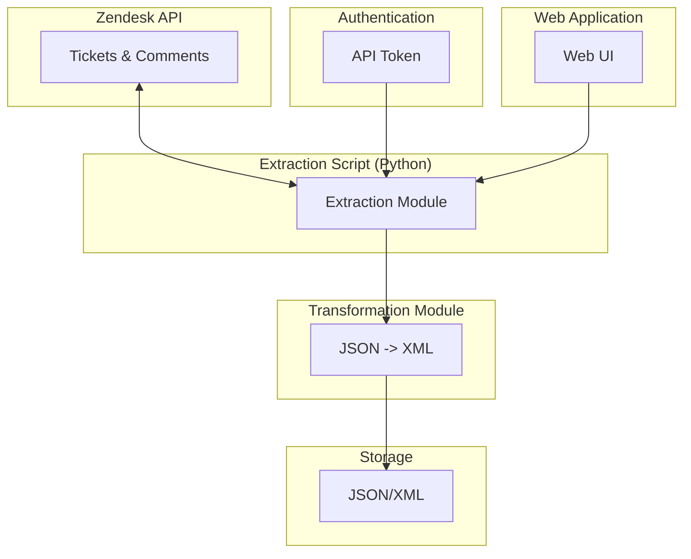

# **Technical Design Document: Zendesk Data Extraction**

## **1. Introduction**

This document outlines the technical design for a solution to extract historical customer conversation data from Zendesk. The current method of manually requesting data from Zendesk support is not scalable, is time-consuming, and lacks the necessary flexibility for querying.

The proposed solution is to build a data pipeline that programmatically extracts ticket data, including the full conversation history, using the Zendesk API. This will enable the data to be used for AI/ML modeling (e.g., sentiment analysis, topic modeling) and for manual review in a human-readable format.

This project now includes a web interface to trigger the extraction process and view the extracted data.

## **2. Goals**

*   **Primary Goal:** To build an automated and scalable data pipeline to extract complete customer conversation data from Zendesk.
*   **Secondary Goal:** To provide the extracted data in two formats:
    *   **JSON:** For ingestion into AI/ML models and other data systems.
    *   **XML:** For manual review by internal teams.
*   **Tertiary Goal:** To provide a simple web interface for initiating and monitoring the extraction process.

## **3. System Architecture**

The system is composed of a core extraction library and a web application.

### **Core Library**

The core library is responsible for handling the communication with the Zendesk API, transforming the data, and saving it to the local filesystem. It is designed to be reusable and can be integrated into other applications.

### **Web Application**

The web application is built using FastAPI and provides a simple user interface for interacting with the core library. It allows users to trigger the extraction process and view the extracted files.

### **Diagram**



## **4. Running the Application with Docker**

The easiest way to run the application is with Docker.

1.  **Build the Docker image:**

    ```bash
    docker build -t zendesk-extractor .
    ```

2.  **Run the Docker container:**

    ```bash
    docker run -p 8000:8000 -e ZENDESK_DOMAIN="your_zendesk_domain" -e ZENDESK_EMAIL="your_zendesk_email" -e ZENDESK_API_TOKEN="your_zendesk_api_token" zendesk-extractor
    ```

    Replace `"your_zendesk_domain"`, `"your_zendesk_email"`, and `"your_zendesk_api_token"` with your actual Zendesk credentials.

3.  **Access the web interface:**

    Open your web browser and go to `http://localhost:8000`.

## **5. Security Considerations**

*   The Zendesk API token is a sensitive credential and must be stored securely. It should not be committed to version control. Using environment variables is a good practice.
*   Access to the extracted data should be restricted to authorized personnel.

## **6. Future Enhancements**

*   **Incremental Backups:** The script could be modified to only fetch tickets that have been updated since the last run.
*   **Database Integration:** The extracted data could be loaded directly into a database (e.g., PostgreSQL, BigQuery) for more advanced querying and analysis.
*   **Authentication for the Web UI:** The web interface could be protected with a login system to restrict access to authorized users.
